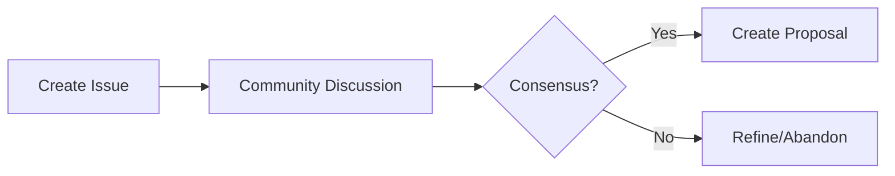

# USHS Governance Model

This document defines the governance structure for the Universal Self-Healing Standard (USHS) and its evolution.

## Table of Contents

1. [Overview](#overview)
2. [Organizational Structure](#organizational-structure)
3. [Roles and Responsibilities](#roles-and-responsibilities)
4. [Decision Making Process](#decision-making-process)
5. [Contribution Process](#contribution-process)
6. [Release Process](#release-process)
7. [Code of Conduct](#code-of-conduct)
8. [Conflict Resolution](#conflict-resolution)

## Overview

The Universal Self-Healing Standard is governed by an open, transparent, and meritocratic process. Our governance model ensures:

- **Open Participation**: Anyone can contribute
- **Transparent Decisions**: All decisions are documented
- **Technical Excellence**: Quality and innovation are prioritized
- **Vendor Neutrality**: No single company controls the standard
- **Community Focus**: Decisions benefit the entire ecosystem

## Organizational Structure

```
┌─────────────────────────────────┐
│    Steering Committee          │
│  (Strategic Direction)         │
└───────────┬────────────────────┘
            │
┌───────────┴────────────────────┐
│   Technical Committee          │
│  (Technical Decisions)         │
└───────────┬────────────────────┘
            │
┌───────────┴────────────────────┐
│     Working Groups             │
│  (Feature Development)         │
├────────────────────────────────┤
│ • Core Protocol WG             │
│ • Security WG                  │
│ • Language Support WG          │
│ • Compliance WG                │
│ • Documentation WG             │
└────────────────────────────────┘
```

### Steering Committee

**Purpose**: Set strategic direction and ensure project health

**Composition**:
- 5-7 members
- Elected for 2-year terms
- Mix of technical and business perspectives
- No more than 2 members from same organization

**Responsibilities**:
- Long-term vision and roadmap
- Budget and resource allocation
- Trademark and licensing decisions
- Conflict resolution (final authority)
- Community outreach

### Technical Committee

**Purpose**: Make technical decisions and maintain quality

**Composition**:
- 7-11 members
- Appointed based on technical contributions
- 1-year renewable terms
- Diverse technology backgrounds

**Responsibilities**:
- Review and approve specification changes
- Maintain technical quality standards
- Coordinate working groups
- Release management
- Architecture decisions

### Working Groups

**Purpose**: Focus on specific areas of the standard

**Structure**:
- Open membership
- Led by 1-2 chairs (TC members or appointees)
- Charter approved by Technical Committee
- Time-bounded objectives

**Current Working Groups**:

#### Core Protocol WG
- REST API evolution
- WebSocket protocol enhancements
- Data schema updates
- Backward compatibility

#### Security WG
- Authentication mechanisms
- Encryption standards
- Vulnerability management
- Security audit processes

#### Language Support WG
- New language integrations
- SDK quality standards
- Cross-language compatibility
- Performance optimization

#### Compliance WG
- Certification programs
- Test suite maintenance
- Compliance tooling
- Audit procedures

#### Documentation WG
- Documentation standards
- Tutorial development
- Translation coordination
- Developer experience

## Roles and Responsibilities

### Contributors

Anyone who:
- Submits pull requests
- Reports issues
- Participates in discussions
- Helps other users

**Rights**:
- Submit changes
- Participate in discussions
- Vote in community polls

### Committers

Contributors who have shown:
- Sustained quality contributions
- Understanding of project goals
- Collaborative approach

**Additional Rights**:
- Merge pull requests
- Participate in release planning
- Nominate other committers

**Responsibilities**:
- Review contributions
- Maintain code quality
- Mentor new contributors

### Maintainers

Committers with deep expertise in specific areas

**Additional Rights**:
- Architecture decisions in their area
- Veto power for their component
- Working group leadership

**Responsibilities**:
- Component ownership
- Technical direction
- Cross-component coordination

## Decision Making Process

### Consensus-Based Approach

1. **Proposal**: Anyone can propose changes
2. **Discussion**: Open discussion period (minimum 7 days)
3. **Revision**: Address feedback and concerns
4. **Decision**: Seek consensus among relevant group

### Voting (When Consensus Fails)

**Technical Committee Votes**:
- Simple majority for minor changes
- 2/3 majority for major changes
- All members must be notified 48 hours before vote

**Steering Committee Votes**:
- 2/3 majority for all decisions
- Quorum: 2/3 of members

### Types of Decisions

#### Minor Changes
- Bug fixes
- Documentation updates
- Clarifications
- Non-breaking additions

**Process**: Single maintainer approval

#### Major Changes
- Breaking changes
- New major features
- Architecture changes
- Process modifications

**Process**: Technical Committee approval

#### Strategic Changes
- Governance modifications
- Licensing changes
- Major partnerships
- Resource allocation

**Process**: Steering Committee approval

## Contribution Process

### 1. Issue Discussion



### 2. Proposal Development

**Proposal Template**:
```markdown
# USHS Improvement Proposal (UIP-XXXX)

## Summary
Brief description of the change

## Motivation
Why this change is needed

## Detailed Design
Technical details and implementation

## Backwards Compatibility
Impact on existing implementations

## Security Considerations
Security implications

## Alternatives Considered
Other approaches and why they were rejected

## Open Questions
Unresolved issues for discussion
```

### 3. Review Process

**Week 1-2**: Initial review and feedback
**Week 3-4**: Revision based on feedback
**Week 5**: Final review and decision

### 4. Implementation

Once approved:
1. Update specification
2. Implement in reference code
3. Update test suite
4. Document changes
5. Announce to community

## Release Process

### Version Numbering

Following Semantic Versioning:
- **Major** (X.0.0): Breaking changes
- **Minor** (x.Y.0): New features, backward compatible
- **Patch** (x.y.Z): Bug fixes, clarifications

### Release Cycle

**Quarterly Releases**:
- January, April, July, October
- Feature freeze 2 weeks before release
- RC period: 1 week

**Patch Releases**:
- As needed for critical fixes
- Minimal review process
- No new features

### Release Checklist

- [ ] All tests passing
- [ ] Documentation updated
- [ ] Migration guide (if needed)
- [ ] Release notes drafted
- [ ] Security audit (major releases)
- [ ] Community notification
- [ ] Update reference implementations

## Code of Conduct

### Our Standards

**Positive Behaviors**:
- Respectful and inclusive language
- Constructive criticism
- Focus on what's best for community
- Showing empathy
- Gracefully accepting feedback

**Unacceptable Behaviors**:
- Harassment or discrimination
- Personal attacks
- Trolling or inflammatory comments
- Publishing private information
- Unethical or unprofessional conduct

### Enforcement

1. **Warning**: First violation
2. **Temporary Ban**: Repeated violations (1-3 months)
3. **Permanent Ban**: Severe or repeated violations

Reports: See project maintainers

## Conflict Resolution

### Technical Conflicts

1. **Discussion**: Attempt to reach consensus
2. **Mediation**: Working group chair facilitates
3. **Escalation**: Technical Committee decides
4. **Appeal**: Steering Committee (final)

### Personal Conflicts

1. **Direct Communication**: Parties attempt resolution
2. **Mediation**: Neutral party facilitates
3. **Formal Process**: Code of Conduct enforcement

### Organizational Conflicts

When organizations have competing interests:
1. Disclosure of conflicts
2. Recusal from relevant decisions
3. Steering Committee arbitration

## Amendments

This governance document can be amended by:
1. Proposal from any community member
2. 30-day comment period
3. 2/3 vote by Steering Committee
4. 14-day implementation period

## Transparency

### Public Records

All of the following are public:
- Meeting minutes
- Decision records
- Financial reports
- Voting results
- Conflict disclosures

### Communication Channels

**Public**:
- GitHub Discussions
- Mailing lists
- Community Chat
- Forum

**Private** (when necessary):
- Security disclosures
- Code of Conduct violations
- Legal matters
- Personnel issues

## Getting Involved

### How to Participate

1. **Join the Community**
   - Sign up for mailing list
   - Join community discussions
   - Watch GitHub repository

2. **Start Contributing**
   - Fix documentation
   - Report bugs
   - Answer questions
   - Submit patches

3. **Deeper Involvement**
   - Join a working group
   - Lead initiatives
   - Become a committer
   - Run for committees

### Recognition

We recognize contributors through:
- Public acknowledgment
- Committer status
- Conference speaking opportunities
- Leadership positions
- Annual awards

## Contact

- **General**: Contact project maintainers
- **Security**: See security policy
- **Conduct**: See code of conduct
- **Legal**: See license information

---

*This governance model is inspired by successful open source projects including Kubernetes, Apache Software Foundation, and Cloud Native Computing Foundation.*

*Last Updated: January 2025*
*Version: 1.0*